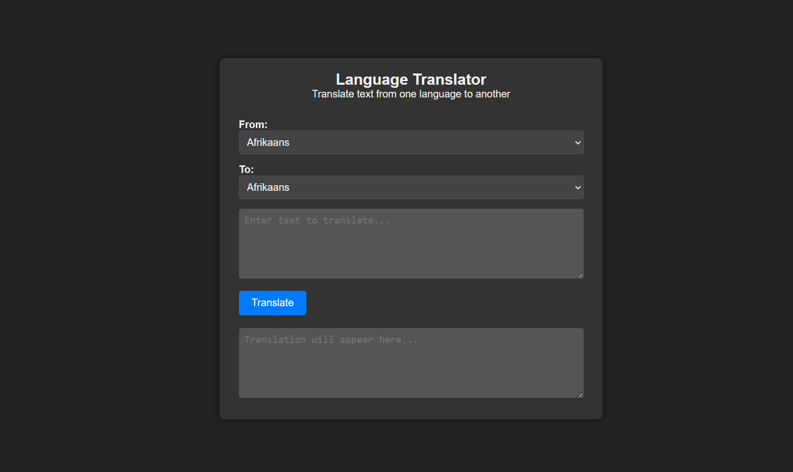

# Language Converter

Language Converter is a web-based tool that allows users to translate text from one language to another using the Google Translate API. This project provides a simple and intuitive graphical user interface (GUI) for translating text across various languages.



## Features

- **Language Selection**: Choose from a wide range of languages for both source and target texts.
- **Translation**: Instantly translate text between selected languages using the Google Translate API.
- **Dark Mode**: Toggle between light and dark themes for better readability.

## Languages Supported

The Language Converter supports translation between the following languages:
- English
- Hindi
- Spanish
- French
- German
- Italian
- Japanese
- Korean
- Portuguese
- Russian
- Chinese (Simplified)
- and more...

## Usage

1. **Input Text**: Enter or paste the text you want to translate into the "Type or Paste Your Text" textarea.
2. **Language Selection**: Choose the source language (From) and the target language (To) from the dropdown menus.
3. **Translate**: Click the "Translate" button to see the translated text in the "Get Translation Here" textarea.
4. **Additional Actions**: Copy the translated text, save it as a text file, print it, or listen to the text using the provided buttons.

## Installation

To run the Language Converter locally:

1. Clone this repository:
   ```
   git clone https://github.com/kanata-05/language-converter.git
   ```

2. Navigate to the project directory:
   ```
   cd language-converter
   ```

3. Open `index.html` in your web browser.

## Contributing

Contributions are welcome! Please read the [CONTRIBUTING.md](./CONTRIBUTING.md) file for details on how to contribute to this project.

## Code of Conduct

Please adhere to our [Code of Conduct](./CODE_OF_CONDUCT.md) to foster an inclusive and respectful community.

## License

This project is licensed under the [CC-BY 3.0 License](./LICENSE).

## Contact

For questions or feedback, you can reach out to us at krishkracks@gmail.com.
